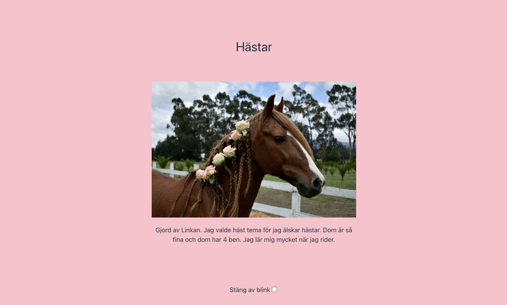

# The Future - My niece's first site

Kids are our future. I prepped a playground for my niece to help her create her first site. Maybe that's something all girls, 10 years of age, should have the opportunity to do in order to strengthen the equality in tech? ❤️

A basic boilerplate was used and prepped. Our steps were then:
1. Choose a fun theme!
2. Decide and insert title
3. Choose 3 backgroundcolors, insert
4. Discuss, choose and insert text for accessibility
5. Chose image, insert
6. Write and insert info-text
7. Celebrate!

## How it went?

"Wow, did I create that?!" The smile from my niece says it all.

## Tech

React, JavaScript, CSS, HTML, accessibility.

## Demo
If I deployed it so she can save it and show her friends/family? Of course!
https://linkan.netlify.app/

## Run project

To run this project locally, follow these steps:

- Clone the repository to your local machine.
- Navigate to the project directory.
- Install dependencies by running npm install.
- Start the development server by running npm start.
- Open local host.
